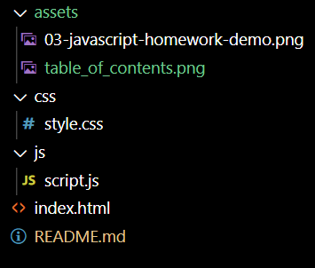

# GT-Coding Bootcamp -- 03 JavaScript: Password Generator

## Table of Contents

1. Overview
2. Table of Contents
3. Mock-Up
4. Links to deployed application

## 1. Overview:

This is an application that generates random passwords based on criteria that is selected by the user. This app runs in the browser, and it features dynamically updated HTML and CSS powered by JavaScript code.

The password can include special characters. If you’re unfamiliar with these, see this [list of password special characters](https://www.owasp.org/index.php/Password_special_characters) from the OWASP Foundation.

## 2. Table of Contents

## 3. Mock-Up

The following image shows the web application's appearance and functionality:

## 4. Links to deployed application

[Click here to go to github repository.](https://github.com/willielibet/password-generator.git)

[Click here to go to deployed application.](https://willielibet.github.io/password-generator/)
